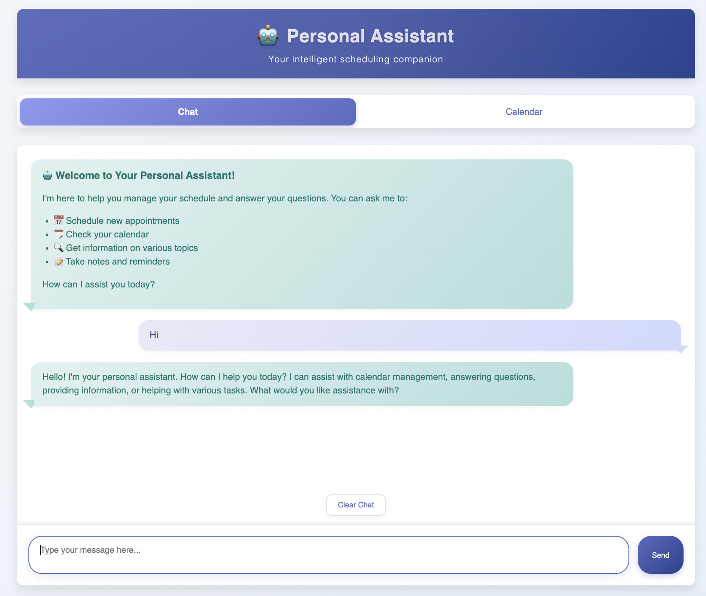
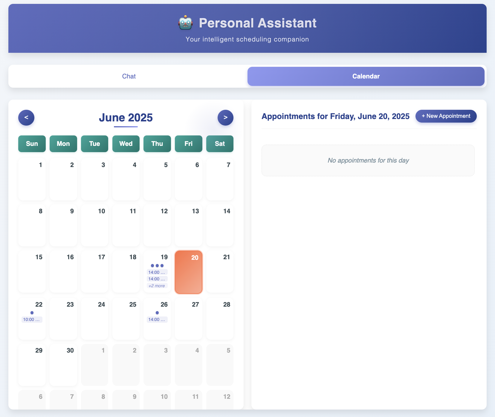

# Personal Assistant Web Application

This is a web-based personal assistant application with a separated frontend and backend architecture.


<table>
  <tr>
    <td></td>
    <td></td>
  </tr>
  <tr>
    <td align="center">Assistant UI</td>
    <td align="center">Calender UI</td>
  </tr>
</table>

## Project Structure

```
deployment/
├── backend/
│   └── app.py         # FastAPI backend
├── frontend/
│   ├── index.html     # HTML structure
│   ├── styles.css     # CSS styling
│   └── app.js         # Frontend JavaScript
└── requirements.txt   # Python dependencies
```

## Setup Instructions

### Option 1: Using Docker (Recommended)

The easiest way to run the application is using Docker and Docker Compose:

```bash
# Build and start the containers
docker-compose up --build
```

This will start:
- Backend API at http://localhost:8000
- Frontend at http://localhost:8080
- API documentation at http://localhost:8000/docs

### Option 2: Manual Setup

#### Backend Setup

1. Create a virtual environment (optional but recommended):
   ```bash
   python -m venv venv
   source venv/bin/activate  # On Windows: venv\Scripts\activate
   ```

2. Install dependencies:
   ```bash
   pip install -r requirements.txt
   ```

3. Run the backend server:
   ```bash
   cd backend
   python app.py
   ```
   
   The backend API will be available at http://localhost:8000
   
   You can also access the API documentation at http://localhost:8000/docs

#### Frontend Setup

You can serve the frontend using any static file server. Here are a few options:

##### Using Python's built-in HTTP server:
```bash
cd frontend
python -m http.server 8080
```

##### Using Node.js and http-server:
```bash
# Install http-server if you haven't already
npm install -g http-server

# Run the server
cd frontend
http-server -p 8080
```

The frontend will be available at http://localhost:8080

## API Endpoints

- `GET /health` - Health check endpoint
- `GET /api/appointments?year=YYYY&month=MM` - Get appointments for a specific month
- `GET /api/appointments/day?date=YYYY-MM-DD` - Get appointments for a specific date
- `POST /api/chat` - Send a message to the assistant

## Technologies Used

- **Backend**: FastAPI (Python)
- **Frontend**: HTML, CSS, JavaScript (Vanilla)
- **AI**: Strands library with Bedrock Claude model

## Benefits of Separated Architecture

1. **Scalability**: Frontend and backend can scale independently
2. **Maintainability**: Clearer separation of concerns
3. **Technology Flexibility**: Can update frontend or backend technologies separately
4. **Performance**: Can deploy frontend to CDN for faster loading
5. **Security**: Better control over API access and authentication

## Data Persistence

This application is configured for ephemeral data storage. The SQLite database is stored within the container and will be reset when the container is restarted or removed. This is ideal for testing and development environments.

If you need data persistence, you would need to:
1. Modify the docker-compose.yml to add a volume for the database
2. Update the DB_PATH environment variable to point to the mounted volume

## Benefits of FastAPI

1. **Performance**: FastAPI is one of the fastest Python frameworks available
2. **Type Checking**: Built-in type checking with Pydantic
3. **Automatic Documentation**: Interactive API documentation with Swagger UI and ReDoc
4. **Modern Python**: Leverages modern Python features (3.6+)
5. **Asynchronous Support**: Built-in support for async/await